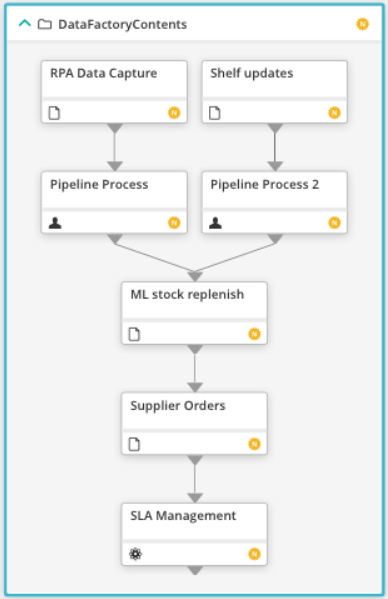

# Control-M Azure Data Factory plugin
Version 9

### Go directly to the Quick Start Guide
https://pmbmc.github.io/ifdocs/#/quickstart

### Short description:
Control-M Integration plugin to Azure data factory (ADF) pipelines.

Created by  on 01-Sep-2020.

Share This:
1
Shares
linkedin sharing button twitter sharing button email sharing button sharethis sharing button
 
### Detailed description:

The Azure Data Factory plugin for Control-M enables the integration of ADF pipelines with the rest of your application 
ecosystem, allowing for a true hyper automated application stack.

Azure data factory is a cloud-based ETL and data integration service that allows you to create data-driven workflows 
for orchestrating data movement and transforming data at scale.

Hyper automation allows for orchestrating a multitude of steps across business processes. In the context of data pipelines
this means that a data source may be the start of a pipeline but it is not the starting point of a business process.
A number of steps would be performed prior to a data pipeline being triggered. Prior steps could be application based where the data 
source is generated as an output from the application. Automating the end to end process provides clear and decisive 
visibility and management of the entire ecosystem, bonding pipelines with supplying applications.

 

