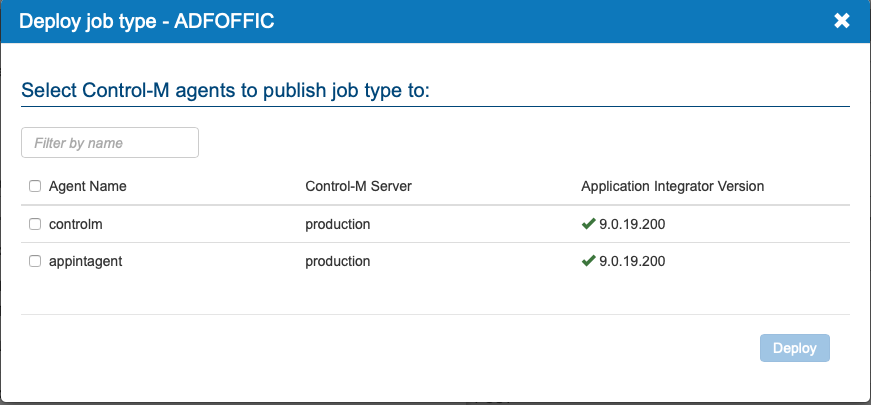
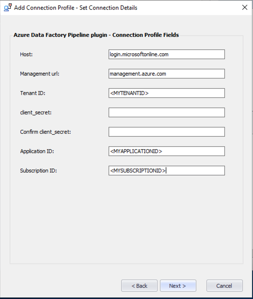
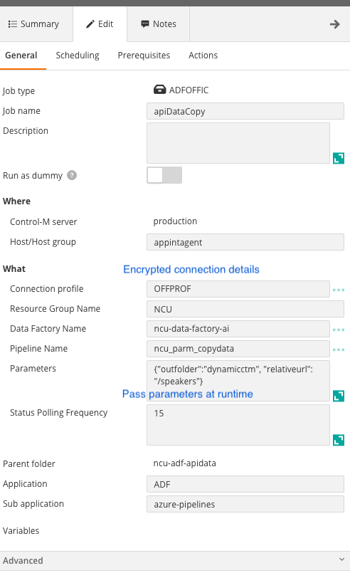

## Installation instructions 
Version 9.15

Created on 10-Sep-2020.
 
### Quick Start:
#### Control-M Integration to Azure data factory (ADF) pipelines.

This plugin is based on REST communication using the Azure
recommended api calls for Azure Data Factory.

https://docs.microsoft.com/en-us/rest/api/datafactory/pipelines/createrun
 
### Installation Details

Prerequisites and installation notes:
 
    1.) Control-M Agent on a supported Linux or Windows environment with the Application Integrator CM
    2.) Azure service account credentials
   
For details regarding Azure service account authorization, please visit the Azure rest page by using the link below

https://docs.microsoft.com/en-us/rest/api/azure/#register-your-client-application-with-azure-ad

  
#### Authentication:
This plugin uses the Azure recommended OAuth2 protocol to authenticate and authorize access to Azure data factory.
No username and passwords are used.

   
#### 1. Download the Azure Data Factory job 
http://github.com/adfaijob.

##### Watch an introduction video on Application Integrator
[AppIntVideo](https://youtu.be/7CshwZYMPWw)

#### 2. Deploy the plugin.
        a. Using the Application Integrator UI
        b. Using the Control-M Automation API  
    
         

        
           
#### 3. Define a connection profile

##### Connection Profile: Used for authenticating with ADF
    Add a new connection profile and input the required fields.
    Note: The client secret details will be encrypted after entry.



#### 4. Define a pipeline job in Control-M with the below details
    
    ===== Pipeline Job Parameters Description =====

| Field | Value |
| --- | --- |
| Connection Profile | The connection profile name that was define in the connection profile step 4 above
| Resource Group Name | ADF Resource Group |
| Data Factory Name | Click the load button for a list Data Factories based on the Resource Group above |
| Pipeline Name | Click the load button for a list of pipelines available to run |
 
##### Job Definition panel
 


#### 5. You can also choose to build your ADF job in Control-M Automation API

Control-M automation api allows for the creation of jobs in a JSON format.
Once you have deployed the ADF plugin you have immediate support for the creation of ADF pipeline
jobs in JSON format.

Sample JSON

```
{
  "myfolder": {
    "Type": "SimpleFolder",
    "ControlmServer": "production",
    "OrderMethod": "Manual",
    "Azure Data Factory Pipeline plugin_Job": {
      "Type": "Job:ApplicationIntegrator:Azure Data Factory Pipeline plugin",
      "ConnectionProfile": "your-connectioprofile",
      "AI-Data Factory Name": "your-data-factory-name",
      "AI-Pipeline Name": "your-pipeline-name",
      "Host": "host-to-run-task-from",
      "CreatedBy": "emuser",
      "RunAs": "runasuser",
      "When": {
        "WeekDays": [
          "NONE"
        ],
        "MonthDays": [
          "ALL"
        ],
        "SpecificDates": [],
        "DaysRelation": "OR"
      }
    }
  }
}
``` 
    
#### 6. Run your first Azure Data Factory pipeline from Control-M


#### 7. The Troubleshooting guide can be found at the following link
https://pmbmc.github.io/ifdocs/#/adf_troubleshooting

##### Performance:
Performance is dependant on your connectivity to Azure.

Note:
    The current job type can be used on Linux and Windows
 
 #### Return to Azure Data Factory plugin Introduction

https://pmbmc.github.io/ifdocs/

