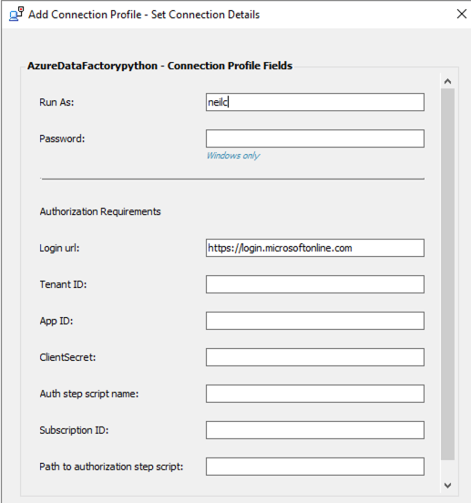
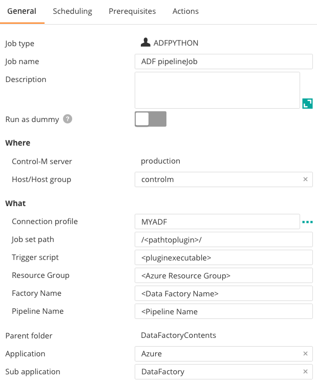

# Installation instructions 
Version 8

Created by Neil Cullum on 01-Sep-2020.

Share This:
1
Shares
linkedin sharing button twitter sharing button email sharing button sharethis sharing button

 
### Quick Start:
#### Control-M Integration to Azure data factory (ADF) pipelines.

This plugin is based on REST communication using the Azure
recommended api calls for Azure Data Factory.

https://docs.microsoft.com/en-us/azure/data-factory/concepts-pipeline-execution-triggers
 
### Installation Details

Prerequisites and installation notes:
 
    Control-M Agent on a supported Linux or Windows environment with the Application Integrator CM

    This plugin was tested on python 3.7

    Azure service account credentials
  
### Authentication:
This plugin uses the Azure recommended OAuth2 protocol to authenticate and authorize access to Azure data factory.
No username and passwords are used.

   
##### 1. Download the Azure Data Factory job from http://github.com/adfaijob.
##### 2. Download the python package from http://github.com/adfaijob/pythonpackage and unzip the contents.

#### Watch an introduction video on Application Integrator
[AppIntVideo](https://youtu.be/7CshwZYMPWw)

##### 3. Deploy the plugin.
        a. Using the Application Integrator UI
        b. Using the Control-M Automation API      
##### 4. Define a connection profile

##### Connection Profile: Used for authenticating with ADF
    Add a new connection profile and input the required fields.
    Note: The connection profile details will be encrypted after entry.



##### 5. Define a pipeline job in Control-M with the below details
    
    ===== Pipeline Job Parameters Description =====

| Field | Value |
| --- | --- |
| Job Set Path | <code>Path to python pipeline executable</code> |
| Trigger Script | <code>Python pipeline executable</code> |
| Resource Group | <code>Azure Resource Group Name</code> |
| Factory Name | <code>Azure Data Factory Name</code> |
| Pipeline Name | <code>Pipeline to be triggered</code> |
 
#### Job Definition panel
 


### Defining a connection profile

##### 6. You can also choose to build your ADF job in Control-M Automation API

Control-M automation api allows for the creation of jobs in a JSON format.
Once you have deployed the ADF plugin you have immediate support for the creation of ADF pipeline
jobs in JSON format.

Sample JSON

```
{
  "adfpython": {
    "Type": "SimpleFolder",
    "ControlmServer": "production",
    "OrderMethod": "Manual",
    "AzureDataFactorypython_Job_2": {
      "Type": "Job:ApplicationIntegrator:AzureDataFactorypython",
      "ConnectionProfile": "<youradfprofile>",
      "AI-Pipeline Name": "<yourPipelineName>",
      "SubApplication": "<Subapp>",
      "Host": "<yourhost>",
      "CreatedBy": "emuser",
      "RunAs": "<youradfprofile>",
      "Application": "<Application>",
      "When": {
        "WeekDays": [
          "NONE"
        ],
        "MonthDays": [
          "ALL"
        ],
        "SpecificDates": [],
        "DaysRelation": "OR"
      }
    }
  }
}


``` 
    
##### 7. Run your first Azure Data Factory pipeline from Control-M

#### Performance:
Performance is dependant on your connectivity to Azure. 

Note:
    The current job type can be used on Linux and Windows
    Tested on : Python 3.7
 
 #### Return to Azure Data Factory plugin Introduction

https://pmbmc.github.io/ifdocs/

